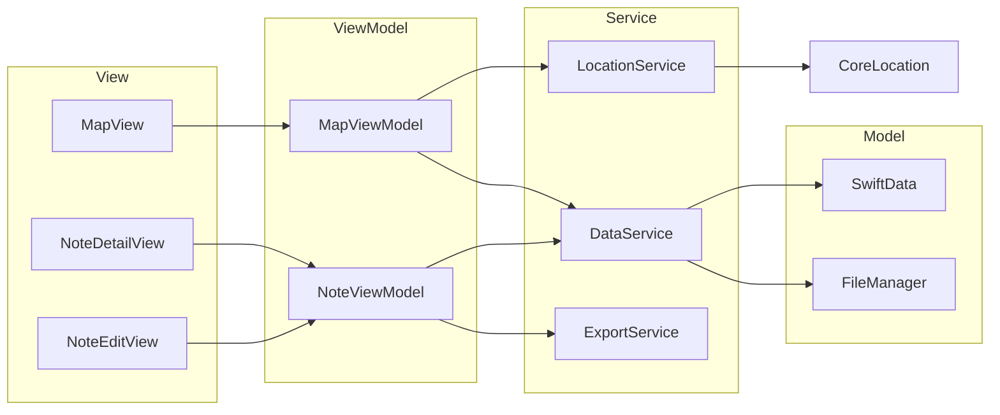

# Architecture — ohnowho

## Tech Stack
| Layer | Technology |
|-------|-----------|
| Language | Swift |
| UI Framework | SwiftUI |
| Persistence | SwiftData |
| Map | MapKit |
| Location | CoreLocation |
| Markdown Rendering | MarkdownUI (third-party) |
| Media Picker | PHPicker (library) / UIImagePickerController (camera) |

## Architecture Pattern: MVVM



## Directory Structure

```
ohnowho-app/
├── App/
│   ├── ohnowhoApp.swift
│   └── ContentView.swift
├── Views/
│   ├── Map/
│   │   └── MapView.swift
│   ├── Note/
│   │   ├── NoteDetailView.swift
│   │   ├── NoteEditView.swift
│   │   └── NoteCardView.swift
│   └── Common/
│       ├── SearchBar.swift
│       ├── MediaViewer.swift
│       └── LocationPickerView.swift
├── ViewModels/
│   ├── MapViewModel.swift
│   └── NoteViewModel.swift
├── Models/
│   ├── Note.swift
│   └── MediaAsset.swift
├── Services/
│   ├── LocationService.swift
│   ├── DataService.swift
│   └── ExportService.swift
├── Utils/
│   ├── Constants.swift
│   └── Extensions.swift
└── Docs/
    ├── PRD.md
    ├── FeatureList.md
    ├── UserFlow.md
    ├── Architecture.md
    ├── DataModel.md
    ├── DesignGuidelines.md
    └── DevelopmentPlan/
        ├── README.md
        ├── Phase-1-Data-Layer-Foundation.md
        ├── Phase-2-Map-Home.md
        ├── Phase-3-Create-Edit-Notes.md
        ├── Phase-4-Note-Detail.md
        ├── Phase-5-Search.md
        └── Phase-6-Data-Import-Export.md
```
