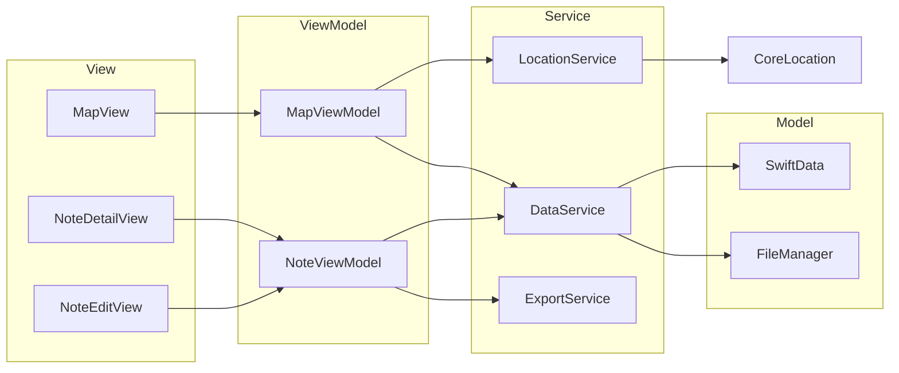

# 架构设计 — OhNoWho

## 技术栈
| 层 | 技术 |
|----|------|
| 语言 | Swift |
| UI 框架 | SwiftUI |
| 数据持久化 | SwiftData |
| 地图 | MapKit |
| 定位 | CoreLocation |
| Markdown 渲染 | MarkdownUI（第三方库） |
| 媒体选择 | PHPicker（相册） / UIImagePickerController（相机） |

## 架构模式：MVVM



## 目录结构规划
```
OhNoWho/
├── App/
│   ├── OhNoWhoApp.swift
│   └── ContentView.swift
├── Views/
│   ├── Map/
│   │   └── MapView.swift
│   ├── Note/
│   │   ├── NoteDetailView.swift
│   │   ├── NoteEditView.swift
│   │   └── NoteCardView.swift
│   └── Common/
│       ├── SearchBar.swift
│       └── MediaViewer.swift
├── ViewModels/
│   ├── MapViewModel.swift
│   └── NoteViewModel.swift
├── Models/
│   ├── Note.swift
│   └── MediaAsset.swift
├── Services/
│   ├── LocationService.swift
│   ├── DataService.swift
│   └── ExportService.swift
└── Utils/
    ├── Constants.swift
    └── Extensions.swift
```
