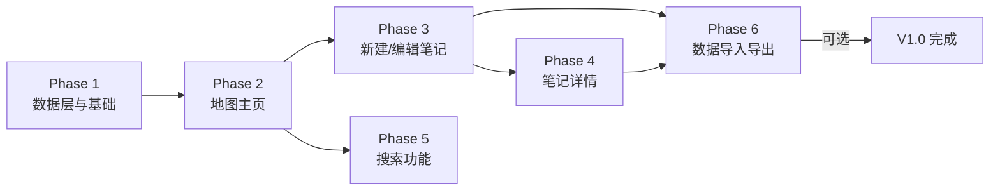
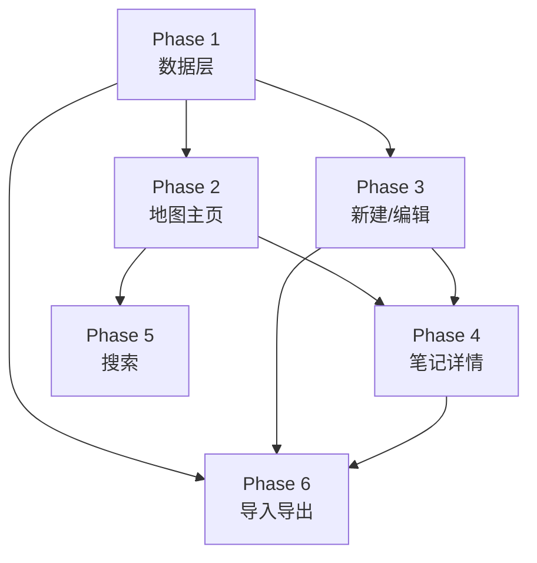

# 分阶段开发计划 — OhNoWho V1.0

> 本文档将 V1.0 所有功能拆分为 6 个可独立验证的开发阶段。
> 每个阶段都包含具体文件清单、实现要点和验收标准。

---

## 阶段总览



| 阶段 | 名称 | 前置依赖 | 预计文件数 |
|------|------|---------|-----------|
| Phase 1 | 数据层与基础架构 | 无 | 8-10 |
| Phase 2 | 地图主页 | Phase 1 | 4-6 |
| Phase 3 | 新建 / 编辑笔记 | Phase 1 | 5-7 |
| Phase 4 | 笔记详情页 | Phase 1, 3 | 4-6 |
| Phase 5 | 搜索功能 | Phase 2 | 2-3 |
| Phase 6 | 数据导入导出 | Phase 1, 3, 4 | 4-5 |

---

## Phase 1 — 数据层与基础架构

### 目标
清除 Xcode 模板代码，建立完整的数据模型层、服务层和项目目录结构。

### 目录结构变更
```
ohnowho-app/
├── App/
│   ├── OhNoWhoApp.swift            # 重命名 + 重构
│   └── ContentView.swift           # 清空为占位，连接 MapView
├── Models/
│   ├── Note.swift                  # 新建：笔记数据模型
│   └── MediaAsset.swift            # 新建：媒体资源模型
├── Services/
│   ├── LocationService.swift       # 新建：定位服务
│   ├── DataService.swift           # 新建：数据操作封装
│   └── ExportService.swift         # 新建：导入导出服务（骨架）
├── Utils/
│   ├── Constants.swift             # 新建：颜色、图标等常量
│   └── Extensions.swift            # 新建：常用扩展方法
├── Views/
│   └── Map/
│       └── MapView.swift           # 新建：占位地图视图
├── Docs/                           # 已有
├── ohnowho-app.xcodeproj/
├── ohnowho-appTests/
└── ohnowho-appUITests/
```

### 步骤

#### Step 1.1 — 清理模板代码
- [ ] 删除 `Item.swift`（模板文件）
- [ ] 删除 `ContentView.swift` 中所有模板列表代码
- [ ] 将 `ContentView.swift` 改为指向 `MapView` 的容器

#### Step 1.2 — 创建数据模型
- [ ] **`Models/Note.swift`** — 创建 `@Model class Note`
  - 字段: `id: UUID`, `title: String?`, `content: String`, `createdAt: Date`, `updatedAt: Date`, `latitude: Double`, `longitude: Double`, `address: String?`
  - 关系: `@Relationship var assets: [MediaAsset]`
- [ ] **`Models/MediaAsset.swift`** — 创建 `@Model class MediaAsset`
  - 字段: `id: UUID`, `type: MediaType`, `filename: String`, `mimeType: String`, `createdAt: Date`, `orderIndex: Int`
  - 枚举: `MediaType: String, Codable { case image, video }`
  - 关系: `var note: Note?`

#### Step 1.3 — 创建服务层
- [ ] **`Services/LocationService.swift`**
  - 封装 `CLLocationManager`
  - `@Published` 属性: `authorizationStatus`, `currentLocation`, `currentAddress`
  - 方法: `requestPermission()`, `startUpdatingLocation()`, `reverseGeocode()`
  - 使用 `async/await` 模式
- [ ] **`Services/DataService.swift`**
  - 封装 SwiftData 操作
  - 方法: `fetchAllNotes()`, `saveNote(_:)`, `deleteNote(_:)`, `fetchNotes(matching:)`
  - 使用 `@MainActor` 确保主线程安全
- [ ] **`Services/ExportService.swift`**
  - 骨架文件，仅定义方法签名
  - 方法: `exportToZip() async throws -> URL`, `importFromZip(_:) async throws`

#### Step 1.4 — 创建工具文件
- [ ] **`Utils/Constants.swift`**
  - 主题色: `AccentColor = Color(hex: "#B22222")` 砖红色
  - SF Symbols 常量: `plusIcon = "plus.circle.fill"`, `pinIcon = "mappin"`, 等
  - 存储目录路径: `mediaDirectory`, `exportDirectory`
- [ ] **`Utils/Extensions.swift`**
  - `Color(hex:)` 初始化器
  - `Date` 格式化扩展
  - `CLLocationCoordinate2D` Equatable 扩展

#### Step 1.5 — 更新 App 入口
- [ ] 重命名 `ohnowho_appApp.swift` → `OhNoWhoApp.swift`
- [ ] 更新 `ModelContainer` 注册 `Note.self`, `MediaAsset.self`
- [ ] 删除 `Item.self` 注册

#### Step 1.6 — 创建占位 MapView
- [ ] **`Views/Map/MapView.swift`** — 空地图视图（`MapReader` + `Map` 基础结构）
- [ ] 包含 `MapViewModel` 的 `@StateObject` 占位

#### Step 1.7 — 更新单元测试
- [ ] 更新 `ohnowho_appTests.swift` 中的测试用例，适配新模型

### 验收标准
- [x] App 能正常编译运行，显示一张空地图
- [x] 不再有任何 `Item` 模板代码引用
- [x] 目录结构符合 Architecture.md 规划
- [x] 定位权限请求逻辑已就绪
- [x] 所有数据模型可在 SwiftData 中正确持久化

### 涉及文件清单
| 操作 | 文件 |
|------|------|
| 删除 | `ohnowho-app/Item.swift` |
| 修改 | `ohnowho-app/ohnowho_appApp.swift` → `OhNoWhoApp.swift` |
| 修改 | `ohnowho-app/ContentView.swift` |
| 新建 | `ohnowho-app/Models/Note.swift` |
| 新建 | `ohnowho-app/Models/MediaAsset.swift` |
| 新建 | `ohnowho-app/Services/LocationService.swift` |
| 新建 | `ohnowho-app/Services/DataService.swift` |
| 新建 | `ohnowho-app/Services/ExportService.swift` |
| 新建 | `ohnowho-app/Utils/Constants.swift` |
| 新建 | `ohnowho-app/Utils/Extensions.swift` |
| 新建 | `ohnowho-app/Views/Map/MapView.swift` |
| 修改 | `ohnowho-app/ohnowho-appTests/ohnowho_appTests.swift` |

---

## Phase 2 — 地图主页

### 目标
实现全屏地图展示、定位用户、显示笔记 Pin、点击 Pin 弹出卡片摘要。

### 步骤

#### Step 2.1 — 创建 MapViewModel
- [ ] **`ViewModels/MapViewModel.swift`**
  - `@Published` 属性: `region: MKCoordinateRegion`, `notes: [Note]`, `selectedNote: Note?`, `isShowingNoteCard: Bool`
  - 方法: `centerOnUser()`, `refreshNotes()`, `selectNote(_:)`, `dismissNoteCard()`
  - 通过 `DataService` 获取笔记列表
  - 通过 `LocationService` 获取当前位置

#### Step 2.2 — 实现全屏地图
- [ ] 在 `MapView.swift` 中集成 `Map`（iOS 17+ MapKit API）
- [ ] 添加 `MapCameraPosition` 绑定
- [ ] 设置初始区域（优先用户位置，否则默认世界视图）
- [ ] 地图占据全屏，忽略安全区域

#### Step 2.3 — 定位权限与用户位置
- [ ] 在 `MapView` 出现时调用 `LocationService.requestPermission()`
- [ ] 授权后自动定位到用户位置
- [ ] 添加「回到当前位置」按钮
- [ ] 地图上显示用户蓝点（`showsUserLocation = true`）

#### Step 2.4 — 显示笔记 Pin
- [ ] 使用 MapKit `Annotation` 或 `MapPolyline` 展示笔记位置
- [ ] 自定义 Pin 样式（使用砖红色调）
- [ ] 每个 Pin 绑定对应的 `Note` 对象

#### Step 2.5 — Pin 点击 → 卡片弹窗
- [ ] 点击 Pin 后弹出底部浮层卡片 `NoteCardView`
- [ ] 卡片内容：标题、地址、创建时间、内容摘要（前 80 字）
- [ ] 卡片底部「查看详情」按钮 → 跳转 Phase 4 详情页（占位 NavigationLink）
- [ ] 卡片上滑手势可关闭

#### Step 2.6 — 底部「+」按钮
- [ ] 浮动在右下角的圆形「+」按钮
- [ ] 点击后触发 Phase 3 新建笔记（占位 Sheet）

#### Step 2.7 — 创建 NoteCardView
- [ ] **`Views/Note/NoteCardView.swift`**
  - 展示标题、地址、时间、摘要
  - 「查看详情」按钮
  - 从 `selectedNote` 驱动

### 验收标准
- [x] 打开 App 后显示全屏地图
- [x] 首次启动请求定位权限
- [x] 授权后定位到用户位置
- [x] 地图上有「回到当前位置」按钮
- [x] 有笔记时显示 Pin
- [x] 点击 Pin 弹出卡片摘要
- [x] 底部「+」按钮可见

### 涉及文件清单
| 操作 | 文件 |
|------|------|
| 新建 | `ohnowho-app/ViewModels/MapViewModel.swift` |
| 修改 | `ohnowho-app/Views/Map/MapView.swift` |
| 新建 | `ohnowho-app/Views/Note/NoteCardView.swift` |
| 新建 | `ohnowho-app/Views/Common/SearchBar.swift`（骨架） |

---

## Phase 3 — 新建 / 编辑笔记

### 目标
实现完整的笔记创建和编辑功能，包括 Markdown 编辑、媒体添加、位置绑定。

### 步骤

#### Step 3.1 — 创建 NoteViewModel
- [ ] **`ViewModels/NoteViewModel.swift`**
  - `@Published` 属性: `title: String`, `content: String`, `mediaAssets: [MediaAsset]`, `location: CLLocationCoordinate2D`, `address: String`, `isSaving: Bool`
  - 方法: `loadNote(_:)`（编辑模式）, `saveNote()`, `addMedia(_:)`, `removeMedia(_:)`, `updateLocation(_:)`
  - 验证: 至少需要内容或媒体才可保存

#### Step 3.2 — 实现 NoteEditView
- [ ] **`Views/Note/NoteEditView.swift`**
  - 底部 Sheet 呈现（`.presentationDetents` 可拖拽高度）
  - 标题输入框
  - Markdown 编辑区域
  - 媒体预览缩略图行（水平滚动）
  - 「添加媒体」按钮 → 拍照 / 相册选择 ActionSheet

#### Step 3.3 — Markdown 编辑器
- [ ] 集成 MarkdownUI 作为渲染预览（可选切换编辑/预览模式）
- [ ] 自制简单工具栏（Bold, Italic, Heading, List, Image 插入）
- [ ] 支持实时切换编辑/预览

#### Step 3.4 — 媒体选择
- [ ] 使用 `PHPickerViewController` 选择图片/视频
- [ ] 使用 `UIImagePickerController` 拍照
- [ ] 选中后复制到 App Sandbox `Documents/media/`
- [ ] 在编辑器中显示媒体缩略图预览

#### Step 3.5 — 位置绑定
- [ ] 自动获取当前位置（`LocationService`）
- [ ] 显示地址文本（若已反向编码）
- [ ] 「调整位置」按钮 → 弹出迷你地图视图，可拖动 Pin
- [ ] 位置为必填，不可保存无位置笔记

#### Step 3.6 — 编辑模式
- [ ] `NoteEditView` 支持传入已有 `Note` 进入编辑模式
- [ ] 编辑时预填所有字段
- [ ] 保存时更新 `updatedAt` 时间戳
- [ ] 标题变更时，地图 Pin 标题同步更新

#### Step 3.7 — 创建 LocationPickerView
- [ ] **`Views/Common/LocationPickerView.swift`**
  - 迷你地图 + 可拖动 Pin
  - 拖拽结束后自动反向编码获取地址
  - 「确认位置」按钮返回结果

### 验收标准
- [x] 点击「+」按钮弹出新建笔记 Sheet
- [x] 可输入标题和 Markdown 正文
- [x] 可从相册选择图片/视频
- [x] 可拍照添加
- [x] 新建时自动绑定位置
- [x] 可手动调整位置（拖动 Pin）
- [x] 保存后地图上出现新 Pin
- [x] 可编辑已有笔记，保存后更新

### 涉及文件清单
| 操作 | 文件 |
|------|------|
| 新建 | `ohnowho-app/ViewModels/NoteViewModel.swift` |
| 新建 | `ohnowho-app/Views/Note/NoteEditView.swift` |
| 新建 | `ohnowho-app/Views/Common/LocationPickerView.swift` |
| 新建 | `ohnowho-app/Views/Common/MediaViewer.swift`（骨架） |

---

## Phase 4 — 笔记详情页

### 目标
实现完整的笔记详情展示，包括 Markdown 渲染、媒体查看、编辑/删除/移动位置操作。

### 步骤

#### Step 4.1 — 实现 NoteDetailView
- [ ] **`Views/Note/NoteDetailView.swift`**
  - 全屏展示笔记内容
  - 顶部：标题 + 创建时间 + 地址
  - 正文：Markdown 渲染（使用 MarkdownUI）
  - 媒体区域：图片可点击查看大图，视频可点击播放
  - 底部工具栏：编辑、删除、移动位置

#### Step 4.2 — Markdown 渲染
- [ ] 使用 MarkdownUI 库渲染笔记正文
- [ ] 支持标题、列表、粗体、斜体、代码块等常见语法
- [ ] 图片链接（如果有）在渲染中显示

#### Step 4.3 — 媒体查看器
- [ ] **`Views/Common/MediaViewer.swift`**
  - 图片：点击后全屏查看大图，支持缩放手势
  - 视频：点击后使用 `AVPlayer` 全屏播放
  - 支持左右滑动切换媒体

#### Step 4.4 — 编辑笔记
- [ ] 点击「编辑」→ 跳转 Phase 3 的 `NoteEditView`（编辑模式）
- [ ] 编辑完成后返回详情页，内容刷新

#### Step 4.5 — 删除笔记
- [ ] 点击「删除」→ 不弹确认，直接删除
- [ ] 底部弹出 Toast：「笔记已删除」+「撤销」按钮
- [ ] 5 秒内点击撤销恢复；超时后永久删除

#### Step 4.6 — 移动位置
- [ ] 点击「移动位置」→ 弹出 `LocationPickerView`
- [ ] 更新后保存新坐标，地图 Pin 同步更新

### 验收标准
- [x] 从地图 Pin 卡片可进入详情页
- [x] Markdown 正文正常渲染
- [x] 图片可点击全屏查看
- [x] 视频可点击播放
- [x] 可编辑笔记，内容实时更新
- [x] 可删除笔记，有撤销 Toast
- [x] 可移动笔记位置，地图同步更新

### 涉及文件清单
| 操作 | 文件 |
|------|------|
| 新建 | `ohnowho-app/Views/Note/NoteDetailView.swift` |
| 修改 | `ohnowho-app/Views/Common/MediaViewer.swift`（完整实现） |
| 修改 | `ohnowho-app/Utils/Extensions.swift`（可能新增 Toast 扩展） |

---

## Phase 5 — 搜索功能

### 目标
实现搜索框，实时过滤地图上的 Pin。

### 步骤

#### Step 5.1 — 实现 SearchBar
- [ ] **`Views/Common/SearchBar.swift`**（完整实现）
  - 顶部搜索框，支持 clear 按钮
  - 输入即搜索，无延迟搜索
  - 显示搜索结果数量

#### Step 5.2 — 搜索逻辑
- [ ] `MapViewModel` 新增 `searchQuery: String`
- [ ] 搜索范围：笔记标题、正文内容、地址文本
- [ ] 使用 `localizedCaseInsensitiveContains` 匹配
- [ ] 搜索时地图仅显示匹配的 Pin
- [ ] 无匹配时地图显示空状态提示

#### Step 5.3 — 搜索 UI 集成
- [ ] 搜索框放置在地图顶部
- [ ] 半透明毛玻璃背景，不遮挡地图
- [ ] 有搜索文本时显示「清除」按钮
- [ ] 清除搜索后恢复显示所有 Pin

### 验收标准
- [x] 地图顶部显示搜索框
- [x] 输入关键词后实时过滤 Pin
- [x] 搜索匹配标题、正文、地址
- [x] 清除搜索后恢复所有 Pin
- [x] 无搜索结果时有提示

### 涉及文件清单
| 操作 | 文件 |
|------|------|
| 修改 | `ohnowho-app/Views/Common/SearchBar.swift`（完整实现） |
| 修改 | `ohnowho-app/ViewModels/MapViewModel.swift`（增加搜索逻辑） |
| 修改 | `ohnowho-app/Services/DataService.swift`（增加搜索方法） |

---

## Phase 6 — 数据导入导出

### 目标
实现全量数据导出为 zip 包和从 zip 包导入恢复。

### 步骤

#### Step 6.1 — 导出服务实现
- [ ] **`Services/ExportService.swift`**（完整实现）
  - 遍历所有 `Note` + 关联 `MediaAsset`
  - 构建 `data.json`（符合 DataModel.md 导出的 JSON 格式）
  - 收集所有媒体文件到 `assets/images/` 和 `assets/videos/`
  - 使用 `Foundation` 的 `ZipFoundation`（或系统 `libarchive`）打包 zip
  - 导出文件名格式: `ohnowho_export_2025-07-04.zip`

#### Step 6.2 — 导入服务实现
- [ ] 读取 zip 包
- [ ] 解析 `data.json`
- [ ] 将媒体文件复制到 App Sandbox
- [ ] 批量导入到 SwiftData
- [ ] 冲突处理：按 `id` 去重，已存在的跳过

#### Step 6.3 — 导出 UI
- [ ] 在设置页面（或地图页菜单）添加「导出数据」按钮
- [ ] 导出时显示 ProgressView
- [ ] 导出完成后弹出 ShareSheet 分享 zip 文件

#### Step 6.4 — 导入 UI
- [ ] 添加「导入数据」按钮
- [ ] 使用 `UIDocumentPickerViewController` 选择 zip 文件
- [ ] 导入时显示进度
- [ ] 导入完成后刷新地图

#### Step 6.5 — 创建设置页面（可选）
- [ ] **`Views/Settings/SettingsView.swift`**
  - 导出数据
  - 导入数据
  - App 版本信息

### 验收标准
- [x] 可导出所有笔记+媒体为 zip 包
- [x] zip 包格式符合 DataModel.md 规范
- [x] 可从 zip 包导入数据
- [x] 导入时按 id 去重
- [x] 导入后地图显示恢复的 Pin

### 涉及文件清单
| 操作 | 文件 |
|------|------|
| 修改 | `ohnowho-app/Services/ExportService.swift`（完整实现） |
| 新建 | `ohnowho-app/Views/Settings/SettingsView.swift` |
| 修改 | `ohnowho-app/Views/Map/MapView.swift`（添加设置入口） |

---

## 开发顺序与依赖关系



**推荐顺序**: Phase 1 → Phase 2 → Phase 3 → Phase 4 → Phase 5 → Phase 6

Phase 5 和 Phase 6 可并行开发，但 Phase 6 依赖 Phase 3/4 的完整数据模型。

---

## 开发约定

### Git 分支策略
- 每个阶段在 `dev` 上创建子分支: `dev/phase-1`, `dev/phase-2`, ...
- 完成一个阶段后合并到 `dev`
- 全部完成后合并 `dev` → `main`

### 代码规范
- 所有 View 使用 `struct` 而非 `class`
- ViewModel 使用 `@Observable`（iOS 17+）或 `ObservableObject`
- 国际化：所有用户可见字符串使用 `String(localized:)` 包裹
- 注释：仅对复杂逻辑写注释，简单属性/方法不注释
- 文件头：保留 Xcode 生成的文件头，不修改

### 测试策略
- 每个阶段完成后手动运行 App 验证
- 单元测试覆盖: DataService 的 CRUD、ExportService 的 JSON 序列化
- UI 测试: 暂不覆盖（时间有限）

---

## 当前进度

- [ ] Phase 1 — 数据层与基础架构
- [ ] Phase 2 — 地图主页
- [ ] Phase 3 — 新建 / 编辑笔记
- [ ] Phase 4 — 笔记详情页
- [ ] Phase 5 — 搜索功能
- [ ] Phase 6 — 数据导入导出
