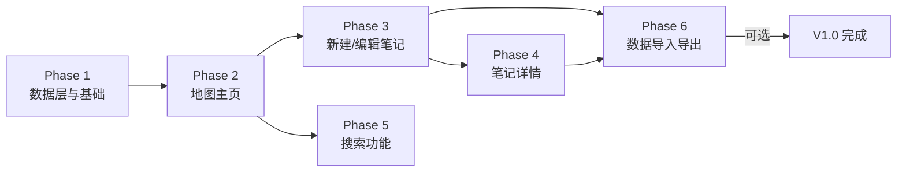
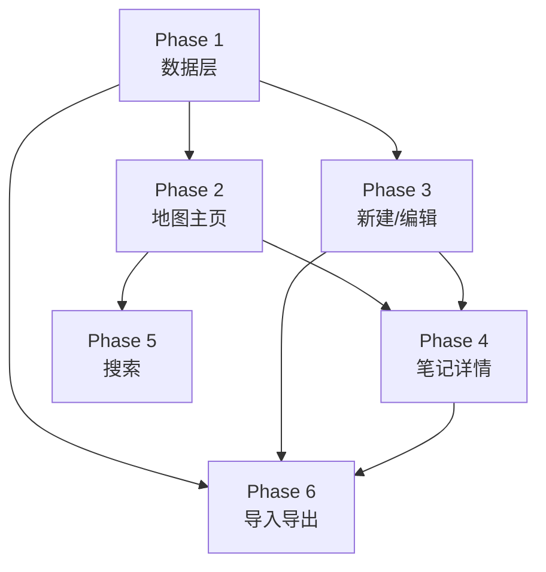

# 分阶段开发计划 — OhNoWho V1.0

> 本文档是开发计划的入口。每个阶段拆分为独立文件，方便逐阶段跟踪和开发。

---

## 阶段一览



| 阶段 | 名称 | 前置依赖 | 文件 |
|------|------|---------|------|
| Phase 1 | 数据层与基础架构 | 无 | [Phase-1-数据层与基础架构.md](./Phase-1-数据层与基础架构.md) |
| Phase 2 | 地图主页 | Phase 1 | [Phase-2-地图主页.md](./Phase-2-地图主页.md) |
| Phase 3 | 新建 / 编辑笔记 | Phase 1 | [Phase-3-新建-编辑笔记.md](./Phase-3-新建-编辑笔记.md) |
| Phase 4 | 笔记详情页 | Phase 1, 3 | [Phase-4-笔记详情页.md](./Phase-4-笔记详情页.md) |
| Phase 5 | 搜索功能 | Phase 2 | [Phase-5-搜索功能.md](./Phase-5-搜索功能.md) |
| Phase 6 | 数据导入导出 | Phase 1, 3, 4 | [Phase-6-数据导入导出.md](./Phase-6-数据导入导出.md) |

## 开发顺序与依赖关系



**推荐顺序**: Phase 1 → Phase 2 → Phase 3 → Phase 4 → Phase 5 → Phase 6

Phase 5 和 Phase 6 可并行开发，但 Phase 6 依赖 Phase 3/4 的完整数据模型。

---

## 全局开发约定

### Git 分支策略
- 每个阶段在 `dev` 上创建子分支: `dev/phase-1`, `dev/phase-2`, ...
- 完成一个阶段后合并到 `dev`
- 全部完成后合并 `dev` → `main`

### 代码规范
- 所有 View 使用 `struct` 而非 `class`
- ViewModel 使用 `@Observable`（iOS 17+）或 `ObservableObject`
- 国际化：所有用户可见字符串使用 `String(localized:)` 包裹
- 注释：仅对复杂逻辑写注释，简单属性/方法不注释
- 文件头：保留 Xcode 生成的文件头，不修改

### 测试策略
- 每个阶段完成后手动运行 App 验证
- 单元测试覆盖: DataService 的 CRUD、ExportService 的 JSON 序列化
- UI 测试: 暂不覆盖（时间有限）

### 目录结构总览
```
ohnowho-app/
├── App/
│   ├── OhNoWhoApp.swift           # App 入口
│   └── ContentView.swift          # 根视图，连接 MapView
├── Models/
│   ├── Note.swift                 # 笔记数据模型
│   └── MediaAsset.swift           # 媒体资源模型
├── ViewModels/
│   ├── MapViewModel.swift         # 地图视图模型
│   └── NoteViewModel.swift        # 笔记视图模型
├── Views/
│   ├── Map/
│   │   └── MapView.swift          # 全屏地图
│   ├── Note/
│   │   ├── NoteDetailView.swift   # 笔记详情
│   │   ├── NoteEditView.swift     # 新建/编辑
│   │   └── NoteCardView.swift     # Pin 卡片摘要
│   ├── Common/
│   │   ├── SearchBar.swift        # 搜索框
│   │   ├── MediaViewer.swift      # 媒体查看器
│   │   └── LocationPickerView.swift # 位置选择器
│   └── Settings/
│       └── SettingsView.swift     # 设置页
├── Services/
│   ├── LocationService.swift      # 定位服务
│   ├── DataService.swift          # 数据操作封装
│   └── ExportService.swift        # 导入导出服务
├── Utils/
│   ├── Constants.swift            # 常量
│   └── Extensions.swift           # 扩展方法
└── Docs/
    ├── DevelopmentPlan/           # ← 本目录
    │   ├── README.md
    │   ├── Phase-1-数据层与基础架构.md
    │   ├── Phase-2-地图主页.md
    │   ├── Phase-3-新建-编辑笔记.md
    │   ├── Phase-4-笔记详情页.md
    │   ├── Phase-5-搜索功能.md
    │   └── Phase-6-数据导入导出.md
    ├── PRD.md
    ├── FeatureList.md
    ├── UserFlow.md
    ├── Architecture.md
    ├── DataModel.md
    └── DesignGuidelines.md
```

## 当前进度

- [ ] Phase 1 — 数据层与基础架构
- [ ] Phase 2 — 地图主页
- [ ] Phase 3 — 新建 / 编辑笔记
- [ ] Phase 4 — 笔记详情页
- [ ] Phase 5 — 搜索功能
- [ ] Phase 6 — 数据导入导出
