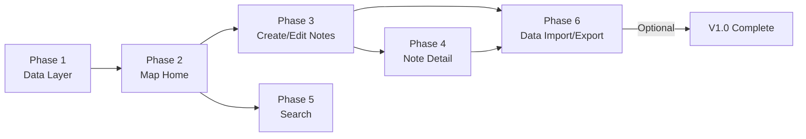
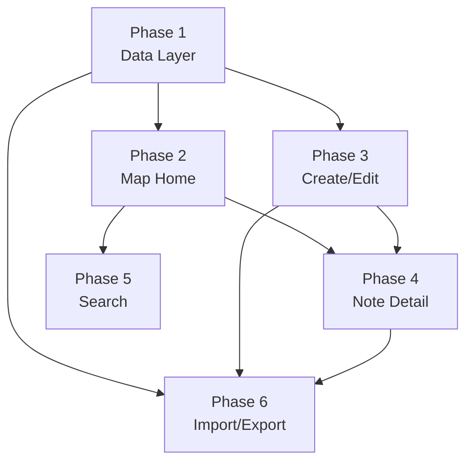

# Development Plan — ohnowho V1.0

> This document is the entry point for the development plan. Each phase is broken into its own file for independent tracking and development.

---

## Phase Overview



| Phase | Name | Dependencies | File |
|-------|------|-------------|------|
| Phase 1 | Data Layer & Foundation | None | [Phase-1-Data-Layer-Foundation.md](./Phase-1-Data-Layer-Foundation.md) |
| Phase 2 | Map Home | Phase 1 | [Phase-2-Map-Home.md](./Phase-2-Map-Home.md) |
| Phase 3 | Create / Edit Notes | Phase 1 | [Phase-3-Create-Edit-Notes.md](./Phase-3-Create-Edit-Notes.md) |
| Phase 4 | Note Detail | Phase 1, 3 | [Phase-4-Note-Detail.md](./Phase-4-Note-Detail.md) |
| Phase 5 | Search | Phase 2 | [Phase-5-Search.md](./Phase-5-Search.md) |
| Phase 6 | Data Import / Export | Phase 1, 3, 4 | [Phase-6-Data-Import-Export.md](./Phase-6-Data-Import-Export.md) |

## Development Order & Dependencies



**Recommended order**: Phase 1 → Phase 2 → Phase 3 → Phase 4 → Phase 5 → Phase 6

Phase 5 and Phase 6 can be developed in parallel, but Phase 6 depends on Phase 3/4's finalized data model.

---

## Global Development Conventions

### Git Branch Strategy
- Each phase creates a sub-branch from `dev`: `phase-1`, `phase-2`, ...
- After completing a phase, merge into `dev`
- When all phases are done, merge `dev` → `main`

### Code Style
- All Views use `struct` not `class`
- ViewModels use `@Observable` (iOS 17+) or `ObservableObject`
- All user-facing strings wrapped in `String(localized:)` for future i18n
- Comments only for complex logic, not for simple properties/methods
- Keep Xcode-generated file headers as-is

### Testing Strategy
- Manually verify the app after each phase
- Unit tests cover: DataService CRUD, ExportService JSON serialization
- UI tests: not covered (time constraints)

### Directory Structure Overview
```
ohnowho-app/
├── App/
│   ├── ohnowhoApp.swift           # App entry point
│   └── ContentView.swift          # Root view, connects MapView
├── Models/
│   ├── Note.swift                 # Note data model
│   └── MediaAsset.swift           # Media asset model
├── ViewModels/
│   ├── MapViewModel.swift         # Map view model
│   └── NoteViewModel.swift        # Note view model
├── Views/
│   ├── Map/
│   │   └── MapView.swift          # Fullscreen map
│   ├── Note/
│   │   ├── NoteDetailView.swift   # Note detail
│   │   ├── NoteEditView.swift     # Create/Edit note
│   │   └── NoteCardView.swift     # Pin summary card
│   ├── Common/
│   │   ├── SearchBar.swift        # Search bar
│   │   ├── MediaViewer.swift      # Media viewer
│   │   └── LocationPickerView.swift # Location picker
│   └── Settings/
│       └── SettingsView.swift     # Settings page
├── Services/
│   ├── LocationService.swift      # Location service
│   ├── DataService.swift          # Data operations
│   └── ExportService.swift        # Import/Export service
├── Utils/
│   ├── Constants.swift            # Constants
│   └── Extensions.swift           # Extensions
└── Docs/
    ├── DevelopmentPlan/           # ← This directory
    │   ├── README.md
    │   ├── Phase-1-Data-Layer-Foundation.md
    │   ├── Phase-2-Map-Home.md
    │   ├── Phase-3-Create-Edit-Notes.md
    │   ├── Phase-4-Note-Detail.md
    │   ├── Phase-5-Search.md
    │   └── Phase-6-Data-Import-Export.md
    ├── PRD.md
    ├── FeatureList.md
    ├── UserFlow.md
    ├── Architecture.md
    ├── DataModel.md
    └── DesignGuidelines.md
```

## Current Progress

- [x] Phase 1 — Data Layer & Foundation ✅
- [ ] Phase 2 — Map Home (in progress)
- [ ] Phase 3 — Create / Edit Notes
- [ ] Phase 4 — Note Detail
- [ ] Phase 5 — Search
- [ ] Phase 6 — Data Import / Export
