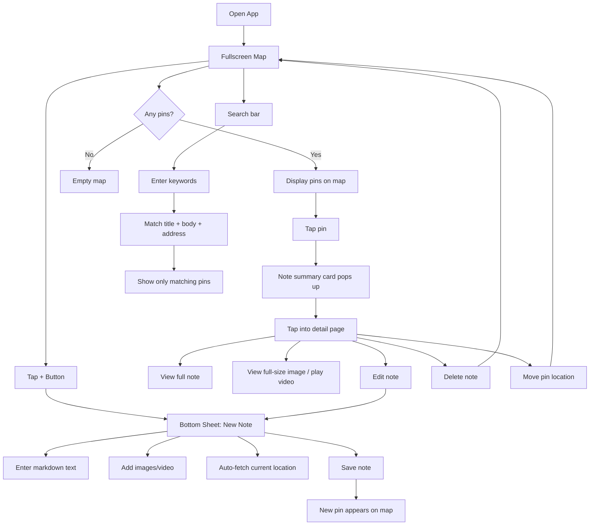
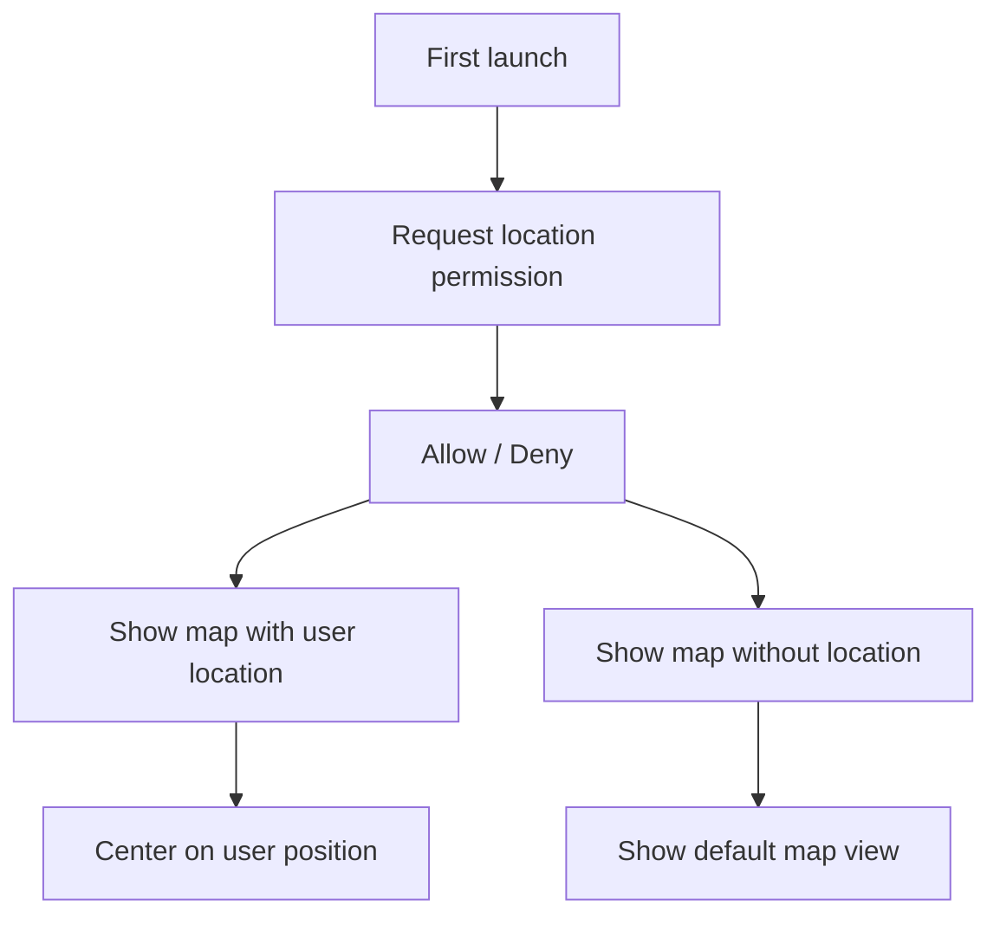

# User Flow — ohnowho

## Core Flow

```mermaid
flowchart TD
    A[Open App] --> B[Fullscreen Map]
    B --> C{Any pins?}
    C -->|Yes| D[Display pins on map]
    C -->|No| E[Empty map]

    B --> F[Tap + Button]
    F --> G[Bottom Sheet: New Note]
    G --> H[Enter markdown text]
    G --> I[Add images/video]
    G --> J[Auto-fetch current location]
    G --> K[Save note]
    K --> L[New pin appears on map]

    D --> M[Tap pin]
    M --> N[Note summary card pops up]
    N --> O[Tap into detail page]

    O --> P[View full note]
    O --> Q[View full-size image / play video]
    O --> R[Edit note] --> G
    O --> S[Delete note] --> B
    O --> T[Move pin location] --> B

    B --> U[Search bar]
    U --> V[Enter keywords]
    V --> W[Match title + body + address]
    W --> X[Show only matching pins]
```

## First Launch Flow

```mermaid
flowchart TD
    A[First launch] --> B[Request location permission]
    B --> C[Allow / Deny]
    C --> D[Show map with user location]
    C --> E[Show map without location]
    D --> F[Center on user position]
    E --> G[Show default map view]
```
